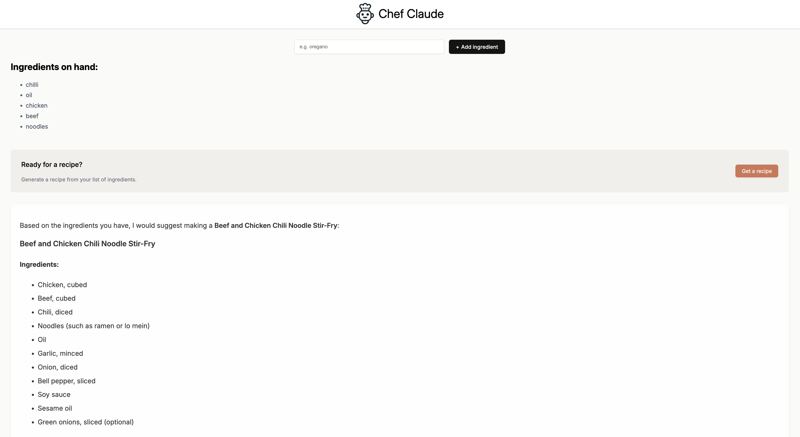
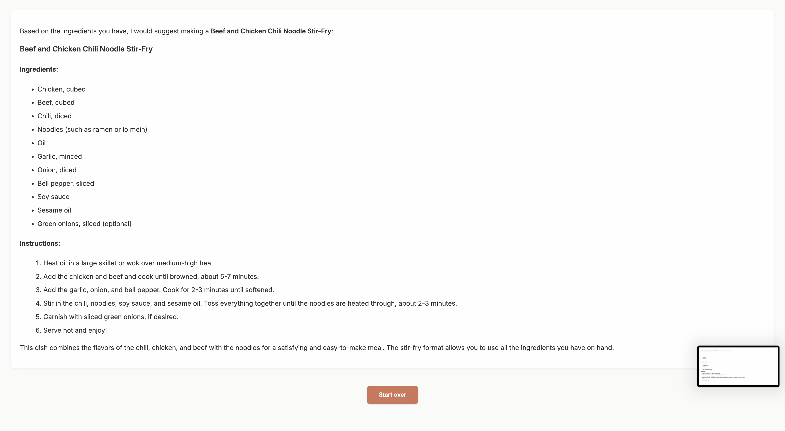

# Claude’s Kitchen 🧑‍🍳✨

Claude’s Kitchen is a smart recipe generator built with React and powered by Anthropic's Claude AI API. Simply enter the ingredients you have on hand, and the app will suggest a delicious recipe you can make — complete with instructions, ingredients, and a clean, readable layout.

This project uses a secure Express backend to protect the Claude API key, and displays AI-generated Markdown recipes using `react-markdown`. It includes a dynamic ingredient form, interactive UI elements, and a polished, responsive design.

---

## 🔧 Tech Stack

- **Frontend:** React + Vite  
- **Backend:** Express (Node.js)  
- **AI Integration:** Claude 3 (Anthropic API)  
- **Markdown Rendering:** `react-markdown`  
- **Styling:** CSS3

---

## 🚀 Features

- Add and manage ingredients with a simple form  
- Generate AI-powered recipes based on your pantry  
- Safe API key handling using a custom Express backend  
- Styled recipe output using Markdown  
- Responsive, beginner-friendly UI  
- “Start Over” button to reset your session  

---

## 📸 Preview

 

